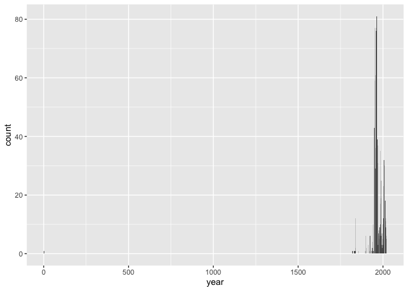
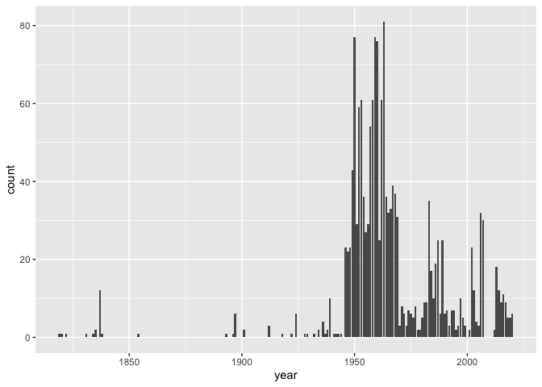

Lab 08 - University of Edinburgh Art Collection
================
Heather Hawkins
01-04-23

### Load packages and data

``` r
library(rvest)
library(skimr)
library(glue)
library(tidyverse) 
library(usethis)
```

### Exercise 1

``` r
# setting the url
first_url <- "https://collections.ed.ac.uk/art/search/*:*/Collection:%22edinburgh+college+of+art%7C%7C%7CEdinburgh+College+of+Art%22?offset=0"

# reading the html page
page <- read_html(first_url)

# Scraping titles

titles <- page %>%
  html_nodes(".iteminfo") %>%
  html_node("h3 a") %>%
  html_text() %>% 
  str_squish()

# Scraping links

links <- page %>%
  html_nodes(".iteminfo") %>%   # same nodes
  html_node("h3 a") %>%         # as before
  html_attr("href") %>%         # but get href attribute instead of text
  str_replace(pattern =".", replacement = "https://collections.ed.ac.uk") #replacing link
```

### Exercise 2

``` r
# scraping artists 

artists <- page %>%
  html_nodes(".iteminfo") %>%
  html_node(".artist") %>%
  html_attr("title")
```

### Exercise 3

``` r
first_ten <- tibble(
  title = titles,
  artist = artists,
  link = links)

first_ten
```

    ## # A tibble: 10 × 3
    ##    title                                           artist           link        
    ##    <chr>                                           <chr>            <chr>       
    ##  1 Unknown (Unknown)                               Margaret Clyde   https://col…
    ##  2 Interior Scene                                  Sigrid Gordon    https://col…
    ##  3 Metope 5, south entablature, Parthenon (1837)   <NA>             https://col…
    ##  4 Portrait of a Young Man (1948)                  Sheena Page      https://col…
    ##  5 Portrait of Seated Man in Uniform (1952)        Frances Walker   https://col…
    ##  6 Unknown (1952)                                  Rosemary Bagshaw https://col…
    ##  7 Legless Graham (Unknown)                        Jennifer Blake   https://col…
    ##  8 House in a Landscape                            Unknown          https://col…
    ##  9 Aphrodite and Eros East Frieze of the Parthenon <NA>             https://col…
    ## 10 Unknown (1950)                                  John W. Corner   https://col…

### Exercise 4

``` r
second_url <- "https://collections.ed.ac.uk/art/search/*:*/Collection:%22edinburgh+college+of+art%7C%7C%7CEdinburgh+College+of+Art%22?offset=10"

page2 <- read_html(second_url)


titles2 <- page2 %>%
  html_nodes(".iteminfo") %>%
  html_node("h3 a") %>%
  html_text() %>%
  str_squish()

links2 <- page2 %>%
  html_nodes(".iteminfo") %>%
  html_node("h3 a") %>%
  html_attr("href") %>%
  str_replace(".", "https://collections.ed.ac.uk/art/")

artists2 <- page2 %>%
  html_nodes(".iteminfo") %>%
  html_node(".artist") %>%
  html_text() %>%
  str_squish()

second_ten <- tibble(
  title = titles2,
  artist = artists2,
  link = links2)

second_ten
```

    ## # A tibble: 10 × 3
    ##    title                                                            artist link 
    ##    <chr>                                                            <chr>  <chr>
    ##  1 Water Dance (Porthmeor) IV (2006)                                Wilhe… http…
    ##  2 Unknown                                                          Unkno… http…
    ##  3 Untitled (1986)                                                  Andre… http…
    ##  4 Untitled (1989)                                                  Joann… http…
    ##  5 Portrait of a Man (1959)                                         Jean … http…
    ##  6 Portrait of a Man (1955)                                         Alexa… http…
    ##  7 Armorial panel from left tower of Mar's Wark, Stirling (Pre 189… Unkno… http…
    ##  8 Vision in Time III (2006)                                        Wilhe… http…
    ##  9 Charioteer facing right                                          <NA>   http…
    ## 10 Untitled (1974)                                                  Fiona… http…

### Exercise 5

``` r
# test

add_two <- function(x){
  x + 2
}

add_two(3)
```

    ## [1] 5

``` r
add_two(10)
```

    ## [1] 12

``` r
# function: scrape_page --------------------------------------------------------

scrape_page <- function(url){
  # read page
  page <- read_html(url)
  
  # scrape titles
  titles <- page %>%
    html_nodes(".iteminfo") %>%
    html_node("h3 a") %>%
    html_text() %>% 
    str_squish()
  
  # scrape links
  links <- page %>%
    html_nodes(".iteminfo") %>%   # same nodes
    html_node("h3 a") %>%         # as before
    html_attr("href") %>%         # but get href attribute instead of text
    
    str_replace(pattern =".", replacement = "https://collections.ed.ac.uk") #replacing
  
  # scrape artists 
  names <- page %>% 
    html_nodes(".iteminfo") %>% 
    html_node(".artist") %>% 
    html_attr("title")
  
  # create and return tibble
  tibble(title = titles, 
         name = names,
         link = links)
  
}
```

### Exercise 6

``` r
scrape_page(first_url)
```

    ## # A tibble: 10 × 3
    ##    title                                           name             link        
    ##    <chr>                                           <chr>            <chr>       
    ##  1 Unknown (Unknown)                               Margaret Clyde   https://col…
    ##  2 Interior Scene                                  Sigrid Gordon    https://col…
    ##  3 Metope 5, south entablature, Parthenon (1837)   <NA>             https://col…
    ##  4 Portrait of a Young Man (1948)                  Sheena Page      https://col…
    ##  5 Portrait of Seated Man in Uniform (1952)        Frances Walker   https://col…
    ##  6 Unknown (1952)                                  Rosemary Bagshaw https://col…
    ##  7 Legless Graham (Unknown)                        Jennifer Blake   https://col…
    ##  8 House in a Landscape                            Unknown          https://col…
    ##  9 Aphrodite and Eros East Frieze of the Parthenon <NA>             https://col…
    ## 10 Unknown (1950)                                  John W. Corner   https://col…

``` r
scrape_page(second_url)
```

    ## # A tibble: 10 × 3
    ##    title                                                             name  link 
    ##    <chr>                                                             <chr> <chr>
    ##  1 Water Dance (Porthmeor) IV (2006)                                 Wilh… http…
    ##  2 Unknown                                                           Unkn… http…
    ##  3 Untitled (1986)                                                   Andr… http…
    ##  4 Untitled (1989)                                                   Joan… http…
    ##  5 Portrait of a Man (1959)                                          Jean… http…
    ##  6 Portrait of a Man (1955)                                          Alex… http…
    ##  7 Armorial panel from left tower of Mar's Wark, Stirling (Pre 1893) Unkn… http…
    ##  8 Vision in Time III (2006)                                         Wilh… http…
    ##  9 Charioteer facing right                                           <NA>  http…
    ## 10 Untitled (1974)                                                   Fion… http…

### Exercise 7

``` r
root <- "https://collections.ed.ac.uk/art/search/*:*/Collection:%22edinburgh+college+of+art%7C%7C%7CEdinburgh+College+of+Art%22?offset="
numbers <- seq(from = 0, to = 3010, by = 10)
urls <- glue("{root}{numbers}")
```

### Exercise 8

\] uoe_art \<- map_dfr(urls, scrape_page)

\]

### Exercise 9

–

## write_csv(uoe_art, file = “uoe-art.csv”)

### Exercise 10

``` r
uoe_art <- read_csv("uoe-art.csv")
```

    ## Rows: 3017 Columns: 3
    ## ── Column specification ────────────────────────────────────────────────────────
    ## Delimiter: ","
    ## chr (3): title, name, link
    ## 
    ## ℹ Use `spec()` to retrieve the full column specification for this data.
    ## ℹ Specify the column types or set `show_col_types = FALSE` to quiet this message.

``` r
uoe_art <- uoe_art %>%
  separate(title, into = c("title", "date"), sep = "\\(") %>%
  mutate(year = str_remove(date, "\\)") %>% as.numeric()) %>%
  select(title, name, year, link)
```

    ## Warning: Expected 2 pieces. Additional pieces discarded in 39 rows [111, 162,
    ## 239, 344, 384, 398, 600, 1032, 1149, 1346, 1352, 1355, 1362, 1460, 1476, 1680,
    ## 1822, 1852, 1884, 2157, ...].

    ## Warning: Expected 2 pieces. Missing pieces filled with `NA` in 650 rows [4,
    ## 7, 31, 34, 40, 43, 54, 60, 62, 63, 68, 73, 83, 86, 91, 113, 114, 120, 131,
    ## 135, ...].

    ## Warning: There was 1 warning in `mutate()`.
    ## ℹ In argument: `year = str_remove(date, "\\)") %>% as.numeric()`.
    ## Caused by warning in `str_remove(date, "\\)") %>% as.numeric()`:
    ## ! NAs introduced by coercion

We have a warning bc some titles did not have the year in (). Bc of
this, they are labeled as NA

### Exercise 11

``` r
skim(uoe_art)
```

|                                                  |         |
|:-------------------------------------------------|:--------|
| Name                                             | uoe_art |
| Number of rows                                   | 3017    |
| Number of columns                                | 4       |
| \_\_\_\_\_\_\_\_\_\_\_\_\_\_\_\_\_\_\_\_\_\_\_   |         |
| Column type frequency:                           |         |
| character                                        | 3       |
| numeric                                          | 1       |
| \_\_\_\_\_\_\_\_\_\_\_\_\_\_\_\_\_\_\_\_\_\_\_\_ |         |
| Group variables                                  | None    |

Data summary

**Variable type: character**

| skim_variable | n_missing | complete_rate | min | max | empty | n_unique | whitespace |
|:--------------|----------:|--------------:|----:|----:|------:|---------:|-----------:|
| title         |         1 |          1.00 |   0 |  95 |     8 |     1388 |          0 |
| name          |       115 |          0.96 |   2 |  55 |     0 |     1116 |          0 |
| link          |         0 |          1.00 |  53 |  56 |     0 |     3017 |          0 |

**Variable type: numeric**

| skim_variable | n_missing | complete_rate |    mean |    sd |  p0 |  p25 |  p50 |  p75 | p100 | hist  |
|:--------------|----------:|--------------:|--------:|------:|----:|-----:|-----:|-----:|-----:|:------|
| year          |      1431 |          0.53 | 1964.38 | 55.47 |   2 | 1953 | 1962 | 1979 | 2020 | ▁▁▁▁▇ |

115 have artist info missing and 1431 have year missing

### Exercise 12

``` r
uoe_art %>%
  ggplot(aes(x=year)) + geom_bar()
```

    ## Warning: Removed 1431 rows containing non-finite values (`stat_count()`).

<!-- -->

``` r
uoe_art %>% filter(year <  50)
```

    ## # A tibble: 1 × 4
    ##   title         name          year link                                         
    ##   <chr>         <chr>        <dbl> <chr>                                        
    ## 1 "Death Mask " H. Dempshall     2 https://collections.ed.ac.uk/record/21649?hi…

### Exercise 13

The Death Mask is labelled as the year “2”, it was actually made in
1964….

``` r
uoe_art<-uoe_art %>% mutate(year = if_else(year == 2, 1964, year))

ggplot(data = uoe_art, aes(x = year)) + geom_bar(binwidth = 100)
```

    ## Warning in geom_bar(binwidth = 100): Ignoring unknown parameters: `binwidth`

    ## Warning: Removed 1431 rows containing non-finite values (`stat_count()`).

<!-- -->

``` r
##YAY
```

### Exercise 14

``` r
uoe_art %>% count(name) %>% arrange(desc(n)) %>% head(10)
```

    ## # A tibble: 10 × 2
    ##    name                 n
    ##    <chr>            <int>
    ##  1 Unknown            357
    ##  2 Emma Gillies       177
    ##  3 <NA>               115
    ##  4 John Bellany        22
    ##  5 Ann F Ward          19
    ##  6 Boris Bućan         17
    ##  7 Marjorie Wallace    17
    ##  8 Zygmunt Bukowski    17
    ##  9 Gordon Bryce        16
    ## 10 William Gillon      16

The MOST commonly featured “artist” is “unknown”- meaning that many
pieces do not have a name attached. the second in Emma Gilles- Idk why
they have so much of her, I was guessing she was born/lived near there
or something- and I was right!! (after googling of course)

### Exercise 15

``` r
uoe_art %>% 
  filter(
    str_detect(title , "child") |
      str_detect(title , "Child")
  )
```

    ## # A tibble: 11 × 4
    ##    title                                                       name   year link 
    ##    <chr>                                                       <chr> <dbl> <chr>
    ##  1 "Child's collar. Chinese"                                   Unkn…    NA http…
    ##  2 "Untitled - Children Playing "                              Moni…  1963 http…
    ##  3 "Woman with Child and Still Life "                          Cath…  1938 http…
    ##  4 "Figure Composition with Nurse and Child, and Woman with B… Edwa…    NA http…
    ##  5 "Virgin and Child "                                         Unkn…    NA http…
    ##  6 "Virgin and Child "                                         Unkn…    NA http…
    ##  7 "Virgin and Child"                                          Unkn…    NA http…
    ##  8 "The Children's Hour "                                      Edua…    NA http…
    ##  9 "Child's chinese headdress"                                 Unkn…    NA http…
    ## 10 "The Sun Dissolves while Man Looks Away from the Unborn Ch… Edua…    NA http…
    ## 11 "Untitled - Portrait of a Woman and Child "                 Will…    NA http…

There are 11 art titles that contain the word child.
